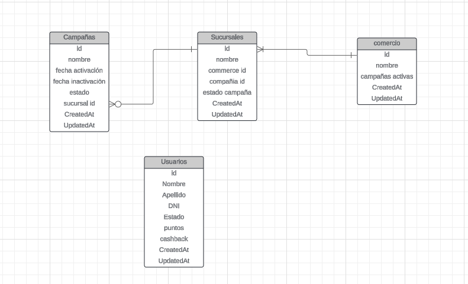

## Explicación de consideraciones de la base de datos.
1. Puedo tener varias campañas configuradas para una sucursal, pero solo una activada al mismo tiempo.
2. La campaña_id que aparece en la tabla `sucursales`, es el id de la última campaña que se haya activado para la sucursal.
3. Cuando se activa una campaña, se modifican los campos `sucursales.campaña_id`, `sucursales.estado_campaña`, `campañas.fecha_activacion`, `campañas.UpdatedAt`
4. Cuando se crea una campaña se modifican se crea con fecha de activación/inactivación, fecha de actualzación null, así como fecha de creación si es la misma al momento de crearla.

## Explicación campaigns
1. Cada campaña tiene un función que arroja float64, según el tipo de campaña que se realice, estas campañas estas organizadas por nombres y propiedades de cada una, según específique el comercio.
2. Estas campañas son usadas en el slicing users, y son invocada según el nombre en la accumulación de cashback / coins

A continuación el Diagrama ER de la base de Datos.
